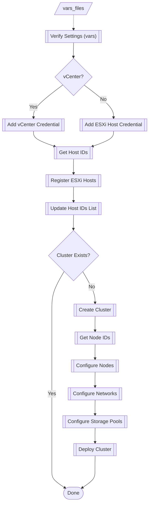

## ONTAP Select Cluster Creation using Deploy Utility REST API

### Description
This is an Ansible role for creating an ONTAP Select cluster using the Deploy Utility REST API. All tasks use the Ansible URI module.

This role is idempotent and can be run repeatedly.

The 'default/main.yml' is well commented, covering each var with a description, usage, and examples. Use this file to build a system-specific vars file for input and modify to suit your needs. If a variable is not set then the relevant task is not invoked. The 'defaults/main.yml' has most of the vars unset so they can be simply omitted from the provided vars input file - Ansible will use the default setting.  There are a few true/false vars with a default value (usually) set to NOT invoke the task. If the SAME setting will always be used, change the 'default/main.yml', otherwise set in a separate vars file and pass to the playbook.

### Disclaimer
The role and associated components are provided as-is and are intended to provide an example of utilizing the ONTAP collection in Ansible. Fully test in a non-production enviornment before implementing. Feel free to utilize/modify any portion of code for your specific needs.

### Requirements
* ONTAP Select 9.8 or later
* Ansible 2.10.3 or later
* NetApp Library: netapp-lib (pip3 install --upgrade netapp-lib)
* Ansible Galaxy Collection: netapp.ontap (https://galaxy.ansible.com/netapp/ontap)
* This role copied to the desired location (ie. ~/roles or Ansible configured roles path) 

### NOTES
**The NetApp ONTAP collection (netapp.ontap) includes several roles and there are related articles available on netapp.io. The roles are located in '{installation_path}/collections/ansible_collections/netapp/ontap/roles'.**

### Dev/Test Environment
* CentOS 8.2
* Ansible 2.10.3
* netapp-lib 
* netapp.ontap collection 20.11.0
* ONTAP Select v9.12
* VMware vSphere 6.7 and 7.0

### Usage
* Example: **ansible-playbook pb_ots_cluster.yml -e "id=1node"**
* Implement password security in compliance with the environment and best practices (separate vars file, ansible-vault, etc)
* A sample playbook and vars files for 1 and 2 node clusters are provided as a reference

### Workflow Tasks
1. Verify Settings (verify.yml)
2. Add vCenter Credential (add_vcenter_credential.yml)
3. Add ESXi Host Credentials - No vCenter (add_credential.yml)
4. Get Existing Host IDs (get_host_ids.yml)
5. Register ESXi Hosts - vCenter (register_esx_vcenter_host.yml)
6. Register ESXi Hosts - No vCenter (register_host.yml)
7. Update Host IDs List (get_host_ids.yml)
8. Validate Internal Network (check_network.yml)
9. Check for Existing Cluster (check_cluster.yml)
10. Create Cluster (create_cluster.yml)
11. Get Cluster ID (get_cluster_id.yml)
12. Get Cluster State (get_cluster_state.yml)
13. Get Node IDs (get_node_ids.yml)
14. Configure Nodes (configure_node.yml)
15. Update Node IDs (get_node_ids.yml)
16. Configure Networks (configure_node_network.yml)
17. Configure Storage Pools (configure_node_storage.yml)
18. Deploy Cluster (deploy_cluster.yml)

### Example Playbook
<pre>
- name: Create ONTAP Select Cluster
  hosts: "localhost"
  gather_facts: false
  vars_files:
  - vars_ots_cluster_create_pwd.yml
  - "vars_ots_cluster_create_{{ id }}.yml"
  tasks:
  - include_role:
      name: ots_cluster_create
</pre>

**The 'tasks/main.yml' calls the required tasks based on the vars file settings**

### Known Issues
*Changing the node names in the vars file will cause an error so leave as "{{ cluster_name }}-##"
